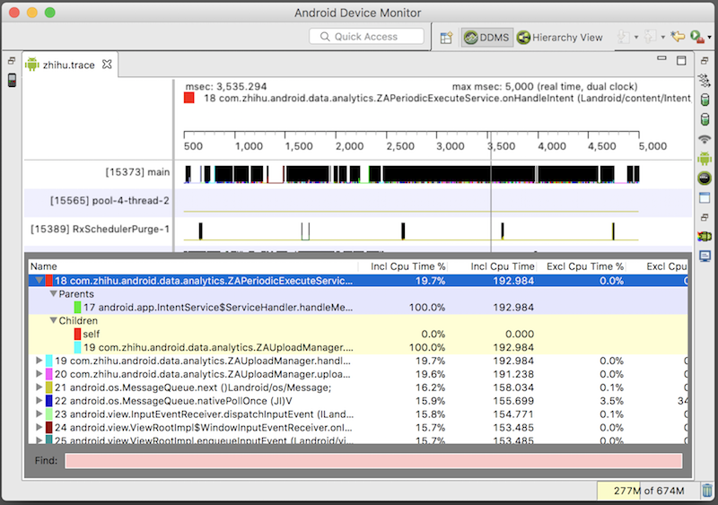

MethodTracerCli is a command-line interface of Android Studio's method tracer.
You can run it independently without Android Studio.
It's very useful when you want to do method tracing on a non-gui environment.
And you can also intergate it to your scripts.


You can download the jar in [here](https://github.com/nekocode/MethodTracerCli/releases).
And you can run the jar with the `-h` option to see the usage message:
```
usage: MethodTracer.jar <app-name> [-a <adb_path>] [-e <device-serial>]
       [-h] [-i <sampling-interval>] [-o <out-file>] [-p <port>] [-t <N>]
A command-line interface of android stuido's method tracer
 -a <adb_path>            Path of adb
 -e <device-serial>       Serial number of traget connected device
 -h,--help                Show this help information
 -i <sampling-interval>   The sampling interval of method tracing (can ben
                          0, default is 10)
 -o <out-file>            Output file name (default is "out.trace")
 -t <N>                   Trace application for N seconds
```

After tracing, you can use the `monitor` in the android sdk tools to open the trace file.



If you want to build this project manually, you should make sure that the Android Studio has been already installed  with a version which is greater than or equals to 3.0.
You can find more informations in the [build.gradle](build.gradle).
